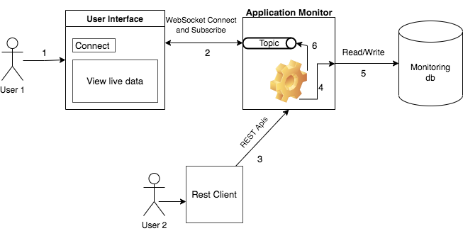
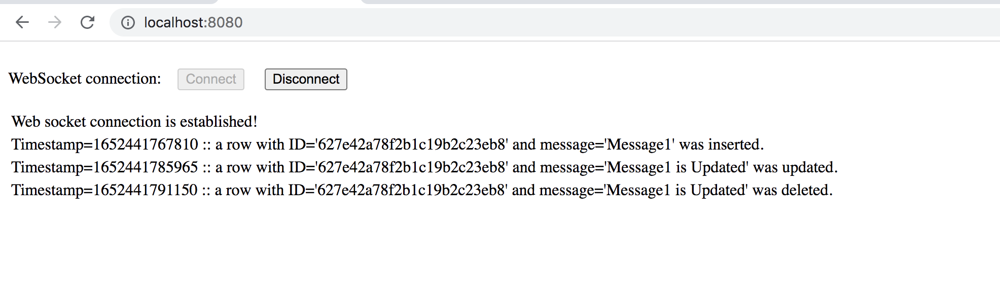

# Spring Boot application with WebSocket + Spring Data MongoDB + Docker

Application which allow two users to communicate between themselves by pushing the messages to the destination user and
the messages are stored in a database.

# Local Development Setup
## Prerequisites

All Maven plugins and dependencies are available from Maven Central. Please have installed:

````
JDK 17 
Maven 3.8+
Docker 4.5.0 (74594)
````

## Building

For building the jar of the application run the following:

````
mvn clean install
````

## Running

This project contains a docker file to create the action-monitor image and docker-compose file to deploy the backend
service and mongo service on docker machine.

To start the deployment make sure that you already build the application and after run the following command:

````
docker-compose up -d
````

Finally, is running and you can check in the browser client on http://localhost:8080

# Architecture diagram



# Test the application

After you navigate on http://localhost:8080 you have to establish WebSocket connection and this will also subscribe to
the topic.

Once connected you can run the following rest calls for persisting the messages and publish them to the same topic.

````
1. Add message:

curl --location --request POST 'localhost:8080/api/v1/message?message=Message1'

2. Get all messages

curl --location --request GET 'localhost:8080/api/v1/message'

3. Update message by id

curl --location --request PUT 'localhost:8080/api/v1/message/{someId}' \
--header 'Content-Type: application/json' \
--data-raw '{
    "id":"{someId}",
    "message":"Message1 Updated"
}'

4. Delete message by id

curl --location --request DELETE 'localhost:8080/api/v1/message/{someId}'

````

All the information is visible in the browser



## Run the tests of the application

Created tests uses TESTCONTAINERS which supports JUnit tests, providing lightweight, throwaway instances of common
databases, or anything else that can run in a Docker container.

Make sure that your docker machine is running and after run the following command:

````
mvn clean test
````

Copyright © 2022 Bogdan Rad


